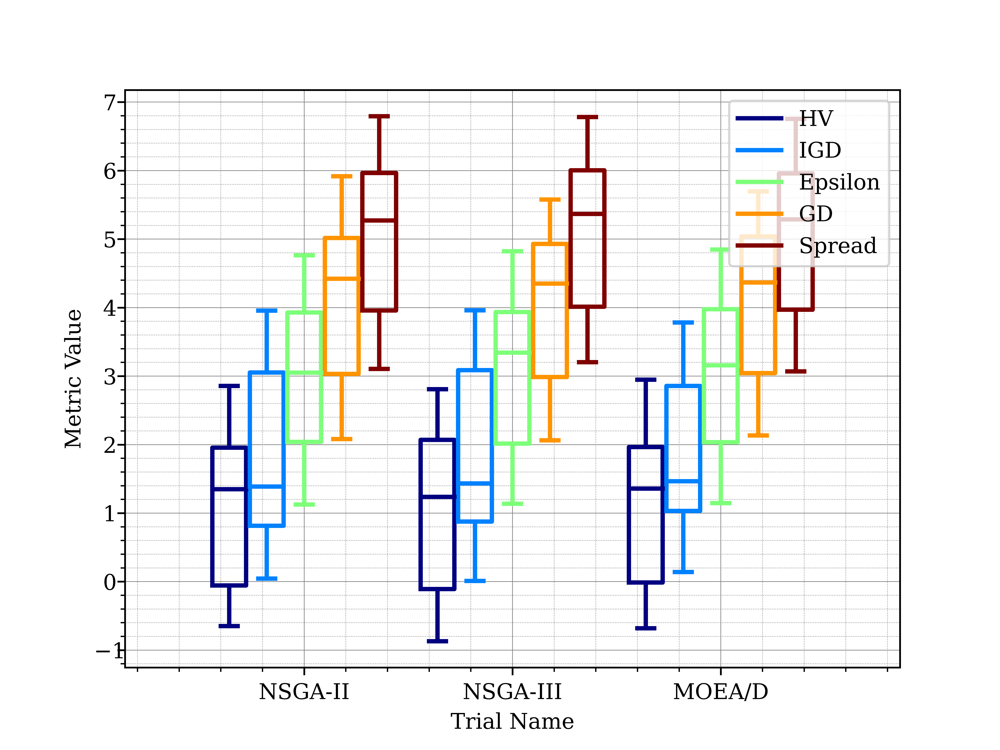
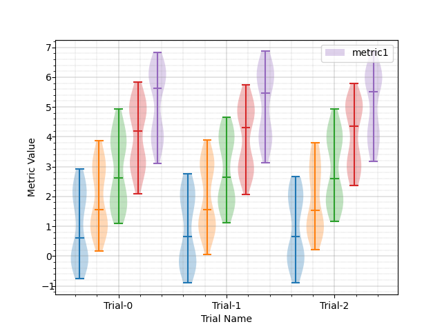
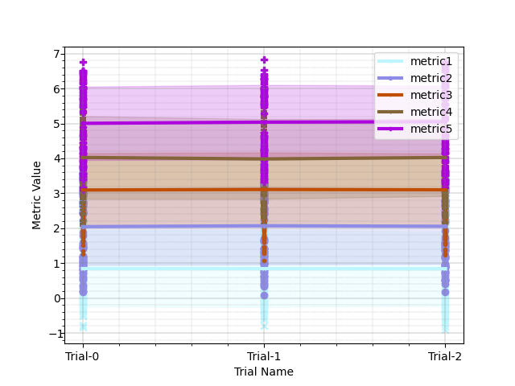

# MetricVisualizer - Automated Experiment Metric Visualizations and Statistics


[](https://pypi.org/project/metric-visualizer/)
[](https://pepy.tech/project/metric-visualizer)
[](https://pepy.tech/project/metric-visualizer)
[](https://pepy.tech/project/metric-visualizer)

## Introduction
这个工具的目的在于自动化实验结果(指标，例如正确率，AUC，F1)等
的记录和统计。实验结果可以快速可视化，统计数据可以轻易导出到txt,xlsx等。

The purpose of this tool is to automate the recording of experimental results (metrics, e.g. correctness, AUC, F1), etc.
The results can be recorded and counted. The results can be visualised quickly and the statistics can be easily exported to txt, xlsx, etc.
Currently only the following features are supported:
- Box plot
- Trajectory plot
- Scatter plot
- Bar plot
- Violin plot
- Scott-Knott rank test plot
- A12 effect size plot
- Wilconxon Rank test
- On the way

## Examples





## Usages

具体用法及例子请参考[example](example/cola_lab_tutorial.ipynb)

## Install

If you want to make tikz(latex) plots, you need to install texlive (other latex release version are not tested).

```bash
pip install metric_visualizer
```


### [Bash] Instant Visualization of MetricVisualizer file (named example.mv)

```bash
mvis example.mv
```

假设存在多组对比实验(或者一组参数设置)，则称之为trial，每组实验存在多个metric(例如AUC，Accuracy，F1，Loss等)，
每组参照实验重复n词，则使用以下方法监听实验结果(监听结束后可自动绘制图形)：
Assume that there exist multiple sets of comparison experiments (or a set of parameter settings), called trials, with
multiple metrics (e.g., AUC, accuracy, F1, loss, etc.) for each set of experiments.
Repeat n words for each set of reference experiments, and then listen to the results of the experiments using the
following method.

```python
import random
from metric_visualizer import MetricVisualizer
import numpy as np

MV = MetricVisualizer(name='example', trial_tag='Model')

repeat = 100  # number of repeats
metric_num = 3  # number of metrics

#  利用metric_visualizer监听实验吧并保存实验结果，随时重新绘制图像
trial_names = ['LSTM', 'CNN', 'BERT']  # fake trial names
# trial_names = ['NSGA-II', 'NSGA-III', 'MOEA/D']  # fake trial names
# trial_names = ['Hyperparameter Setting 1', 'Hyperparameter Setting 2', 'Hyperparameter Setting 3']  # fake trial names

for n_trial in range(len(trial_names)):
    for r in range(repeat):  # repeat the experiments to plot violin or box figure
        metrics = [(np.random.random() + n + (1 if random.random() > 0.5 else -1)) for n in
                   range(metric_num)]  # n is metric scale factor
        for i, m in enumerate(metrics):
            # MV.add_metric(metric_name='metric{}'.format(i + 1), value=m)  # add metric by custom name and value
            MV.log_metric(trial_name=trial_names[n_trial], metric_name='metric{}'.format(i + 1),
                          value=m)  # add metric by custom name and value
    # MV.next_trial()  # next_trial() should be used with add_metric() to add metrics of different trials

# MV.remove_outliers()  # remove outliers

MV.summary(no_print=False)
```

```html
 -------------------- Metric Summary --------------------
╒══════════╤═════════╤══════════════════════════════════════════════════════════════╤═════════════════════════════════════════════════════════════╕
│ Metric   │ Trial   │ Values                                                       │ Summary                                                     │
╞══════════╪═════════╪══════════════════════════════════════════════════════════════╪═════════════════════════════════════════════════════════════╡
│ Metric-1 │ trial-0 │ [0.35, 0.65, 0.67, 0.51, 0.04, 0.43, 0.46, 0.58, 0.11, 0.66] │ ['Avg:0.45, Median: 0.48, IQR: 0.22, Max: 0.67, Min: 0.04'] │
├──────────┼─────────┼──────────────────────────────────────────────────────────────┼─────────────────────────────────────────────────────────────┤
│ Metric-1 │ trial-1 │ [0.52, 0.1, 0.11, 0.86, 0.49, 0.7, 0.77, 0.96, 0.16, 0.65]   │ ['Avg:0.53, Median: 0.58, IQR: 0.41, Max: 0.96, Min: 0.1']  │
├──────────┼─────────┼──────────────────────────────────────────────────────────────┼─────────────────────────────────────────────────────────────┤
│ Metric-1 │ trial-2 │ [0.73, 0.99, 0.13, 0.72, 0.63, 0.61, 0.14, 0.85, 0.71, 0.86] │ ['Avg:0.64, Median: 0.72, IQR: 0.17, Max: 0.99, Min: 0.13'] │
├──────────┼─────────┼──────────────────────────────────────────────────────────────┼─────────────────────────────────────────────────────────────┤
│ Metric-1 │ trial-3 │ [0.99, 0.69, 0.86, 0.2, 0.4, 0.1, 0.05, 0.07, 0.95, 0.31]    │ ['Avg:0.46, Median: 0.36, IQR: 0.62, Max: 0.99, Min: 0.05'] │
├──────────┼─────────┼──────────────────────────────────────────────────────────────┼─────────────────────────────────────────────────────────────┤
│ Metric-1 │ trial-4 │ [0.58, 0.95, 0.73, 0.63, 0.04, 0.19, 0.5, 0.9, 0.64, 0.89]   │ ['Avg:0.6, Median: 0.64, IQR: 0.27, Max: 0.95, Min: 0.04']  │
├──────────┼─────────┼──────────────────────────────────────────────────────────────┼─────────────────────────────────────────────────────────────┤
│ Metric-2 │ trial-0 │ [1.58, 1.32, 1.98, 1.76, 1.31, 1.6, 1.6, 1.22, 1.3, 1.19]    │ ['Avg:1.49, Median: 1.45, IQR: 0.29, Max: 1.98, Min: 1.19'] │
├──────────┼─────────┼──────────────────────────────────────────────────────────────┼─────────────────────────────────────────────────────────────┤
│ Metric-2 │ trial-1 │ [1.88, 1.67, 1.77, 1.94, 1.01, 1.6, 1.25, 1.63, 1.62, 1.91]  │ ['Avg:1.63, Median: 1.65, IQR: 0.21, Max: 1.94, Min: 1.01'] │
├──────────┼─────────┼──────────────────────────────────────────────────────────────┼─────────────────────────────────────────────────────────────┤
│ Metric-2 │ trial-2 │ [1.4, 1.94, 1.28, 1.78, 1.01, 1.08, 1.21, 1.82, 1.78, 1.18]  │ ['Avg:1.45, Median: 1.34, IQR: 0.59, Max: 1.94, Min: 1.01'] │
├──────────┼─────────┼──────────────────────────────────────────────────────────────┼─────────────────────────────────────────────────────────────┤
│ Metric-2 │ trial-3 │ [1.79, 1.35, 1.14, 1.5, 1.73, 1.06, 1.98, 1.75, 1.07, 1.49]  │ ['Avg:1.49, Median: 1.5, IQR: 0.49, Max: 1.98, Min: 1.06']  │
├──────────┼─────────┼──────────────────────────────────────────────────────────────┼─────────────────────────────────────────────────────────────┤
│ Metric-2 │ trial-4 │ [1.93, 1.81, 1.18, 1.08, 1.57, 1.85, 1.95, 1.94, 1.58, 1.35] │ ['Avg:1.62, Median: 1.7, IQR: 0.43, Max: 1.95, Min: 1.08']  │
├──────────┼─────────┼──────────────────────────────────────────────────────────────┼─────────────────────────────────────────────────────────────┤
│ Metric-3 │ trial-0 │ [2.85, 2.87, 2.3, 2.05, 2.86, 2.34, 2.85, 2.3, 2.95, 2.53]   │ ['Avg:2.59, Median: 2.69, IQR: 0.54, Max: 2.95, Min: 2.05'] │
├──────────┼─────────┼──────────────────────────────────────────────────────────────┼─────────────────────────────────────────────────────────────┤
│ Metric-3 │ trial-1 │ [2.31, 2.41, 2.34, 2.96, 2.48, 2.68, 2.99, 2.94, 2.01, 2.46] │ ['Avg:2.56, Median: 2.47, IQR: 0.44, Max: 2.99, Min: 2.01'] │
├──────────┼─────────┼──────────────────────────────────────────────────────────────┼─────────────────────────────────────────────────────────────┤
│ Metric-3 │ trial-2 │ [2.65, 2.5, 2.68, 2.34, 2.32, 2.61, 2.61, 2.88, 2.86, 2.36]  │ ['Avg:2.58, Median: 2.61, IQR: 0.24, Max: 2.88, Min: 2.32'] │
├──────────┼─────────┼──────────────────────────────────────────────────────────────┼─────────────────────────────────────────────────────────────┤
│ Metric-3 │ trial-3 │ [2.29, 2.12, 2.4, 2.81, 2.5, 2.54, 2.82, 2.61, 2.45, 2.44]   │ ['Avg:2.5, Median: 2.48, IQR: 0.16, Max: 2.82, Min: 2.12']  │
├──────────┼─────────┼──────────────────────────────────────────────────────────────┼─────────────────────────────────────────────────────────────┤
│ Metric-3 │ trial-4 │ [2.41, 2.12, 2.31, 2.29, 2.46, 2.95, 2.74, 2.66, 2.34, 2.65] │ ['Avg:2.49, Median: 2.44, IQR: 0.33, Max: 2.95, Min: 2.12'] │
╘══════════╧═════════╧══════════════════════════════════════════════════════════════╧═════════════════════════════════════════════════════════════╛
-------------------- Metric Summary --------------------
```
