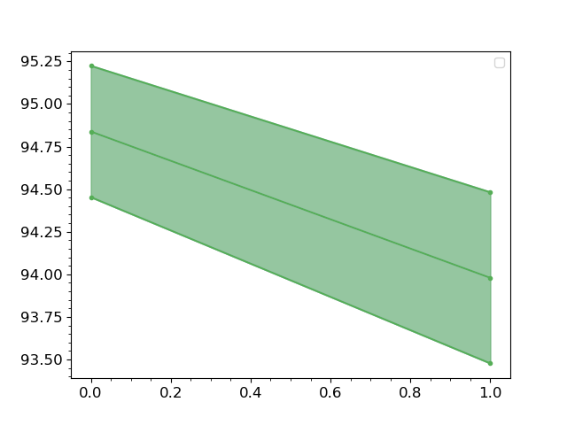
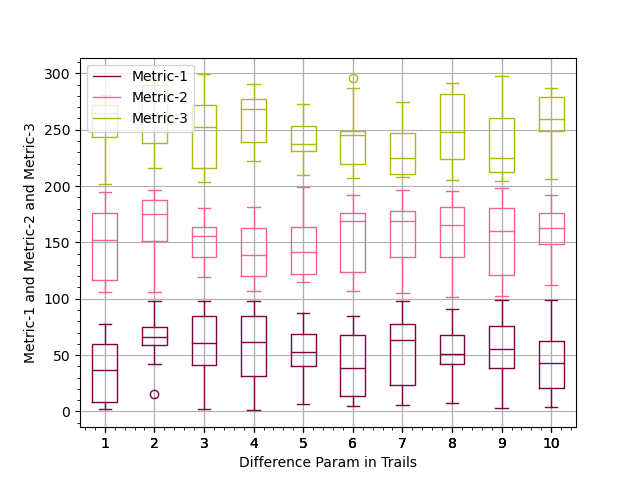
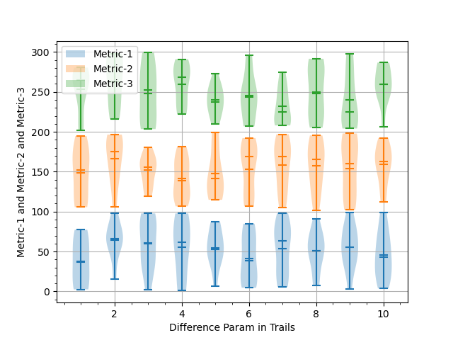

# MetricVisualizer - for easy managing performance metric

## Install

```bash
pip install metric_visualizer
```

## Usage
If you need to run trail experiments, you can use this tool to make simple plots then fix it manually. 
```python3
from metric_visualizer import MetricVisualizer

"""
    if two metrics are used,
    'Metric1': {
        'trail-0': [80.41, 79.78, 81.03, 80.09, 79.62, 80.56, 80.88, 79.94, 79.47, 79.78, 80.72, 79.78, 81.35, 80.88, 81.03],
        'trail-1': [80.41, 79.78, 81.03, 80.09, 79.62, 80.56, 80.88, 79.94, 79.47, 79.78, 80.72, 79.78, 81.35, 80.88, 81.03],
        'trail-2': [80.41, 79.78, 81.03, 80.09, 79.62, 80.56, 80.88, 79.94, 79.47, 79.78, 80.72, 79.78, 81.35, 80.88, 81.03],
    },
    'Metric2': {
        'trail-0': [76.79, 75.49, 77.92, 77.21, 75.63, 76.96, 77.44, 76.26, 76.35, 76.12, 76.12, 76.78, 75.64, 77.31, 73.79],
        'trail-1': [76.79, 75.49, 77.92, 77.21, 75.63, 76.96, 77.44, 76.26, 76.35, 76.12, 76.12, 76.78, 75.64, 77.31, 73.79],
        'trail-2': [76.79, 75.49, 77.92, 77.21, 75.63, 76.96, 77.44, 76.26, 76.35, 76.12, 76.12, 76.78, 75.64, 77.31, 73.79],
    }
"""
MV = MetricVisualizer()

...

for trail in Trails:
    acc, f1 = evaluate(model, test_dataloader)
    MV.add_metric('Accuracy', 96.5)
    MV.add_metric('F1', 94.1)

...

save_path = '{}_{}'.format(model_name, dataset_name)
MV.summary(save_path=save_path)  # save fig into .tex and .pdf foramt
MV.traj_plot(save_path=save_path)  # save fig into .tex and .pdf foramt
MV.violin_plot(save_path=save_path)  # save fig into .tex and .pdf foramt
MV.box_plot(save_path=save_path)  # save fig into .tex and .pdf foramt

MV.summary(save_path=None)  # show the fig via matplotlib
MV.traj_plot(save_path=None)  # show the fig via matplotlib
MV.violin_plot(save_path=None)  # show the fig via matplotlib
MV.box_plot(save_path=None)  # show the fig via matplotlib
```

### Traj Plot



### Box Plot



### Violin Plot



## Real Usage Example in PyABSA

To analyze the impact of max_seq_len, we can use MetricVisualizer as following:
```bash
pip install pyabsa  # install pyabsa
```
```python3

# -*- coding: utf-8 -*-
# file: metric_visualization.py
# time: 2021/5/26 0026
# author: yangheng <yangheng@m.scnu.edu.cn>
# github: https://github.com/yangheng95
# Copyright (C) 2021. All Rights Reserved.

import random

from metric_visualizer import MetricVisualizer

from pyabsa.functional import Trainer
from pyabsa.functional import APCConfigManager
from pyabsa.functional import ABSADatasetList
from pyabsa.functional import APCModelList

import warnings

warnings.filterwarnings('ignore')

seeds = [random.randint(0, 10000) for _ in range(3)]

max_seq_lens = [60, 70, 80, 90, 100]

apc_config_english = APCConfigManager.get_apc_config_english()
apc_config_english.model = APCModelList.FAST_LCF_BERT
apc_config_english.lcf = 'cdw'
apc_config_english.max_seq_len = 80
apc_config_english.cache_dataset = False
apc_config_english.patience = 10
apc_config_english.seed = seeds

MV = MetricVisualizer()
apc_config_english.MV = MV

for max_seq_len in max_seq_lens:
    apc_config_english.eta = max_seq_len
    Laptop14 = ABSADatasetList.Laptop14
    Trainer(config=apc_config_english,
            dataset=Laptop14,  # train set and test set will be automatically detected
            checkpoint_save_mode=0,  # =None to avoid save model
            auto_device=True  # automatic choose CUDA or CPU
            )
    apc_config_english.MV.next_trail()

save_path = '{}_{}'.format(apc_config_english.model_name, apc_config_english.dataset_name)
MV.summary(save_path=None)
MV.traj_plot(save_path=None)
MV.violin_plot(save_path=None)
MV.box_plot(save_path=None)

try:
    MV.summary(save_path=save_path)
    MV.traj_plot(save_path=save_path)
    MV.violin_plot(save_path=save_path)
    MV.box_plot(save_path=save_path)
except Exception as e:
    pass

```
